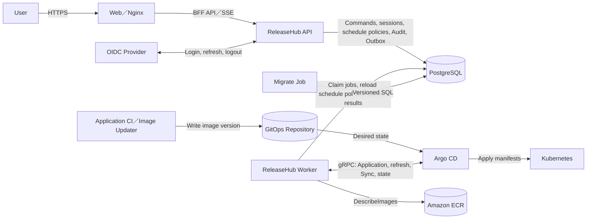
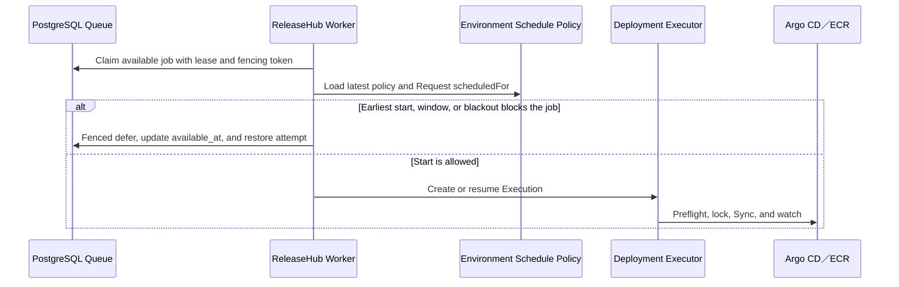

# Architecture

Start with the [Production Release Guide](release-flow.md) when preparing or running a release. This page stays focused on runtime boundaries and control flow.

## Purpose and Scope

This document explains ReleaseHub runtime boundaries, data sources, and deployment control flow to platform developers and operators. ReleaseHub governs releases; it does not replace the GitOps repository, Image Updater, Argo CD, or Kubernetes controllers.

## Component Responsibilities

ReleaseHub provides four independent workloads from two container images:

| Workload | Image               | Responsibility                                                                                        |
| -------- | ------------------- | ----------------------------------------------------------------------------------------------------- |
| Web      | `releasehub-web`    | Static frontend, BFF API reverse proxy, and quiet health checks                                       |
| API      | `releasehub-server` | Gin HTTP API, OIDC sessions, RBAC, and management operations                                          |
| Worker   | `releasehub-server` | Candidate reconciliation, deployment queue processing, Argo CD execution, and notification projection |
| Migrate  | `releasehub-server` | Versioned SQL migrations before application deployment                                                |

API, Worker, and Migrate each use their configured PostgreSQL connection pool. OIDC sessions, Deployment Requests, Deployment Schedule policies, the queue, Audit, and Outbox records are stored in PostgreSQL. The configuration schema currently reserves `redis.*` fields, but the runtime does not use Redis for sessions or queue storage.

Migrate is a separate one-shot Job; API and Worker never run migrations during startup. Worker uses the Argo CD gRPC API to read and operate Applications, and uses read-only AWS ECR APIs to verify image digests.

## System Boundaries and Data Flow

The GitOps repository and Image Updater keep their existing responsibilities. Image Updater or Application CI writes new image versions to the GitOps repository, and Git remains the desired state consumed by Argo CD. ReleaseHub does not write Git, control Image Updater, or set image overrides.

## Production Release Control Flow

1. Worker detects a production Candidate from Argo CD target manifests and live state.
2. Worker verifies images through ECR and creates an immutable Deployment Request Version.
3. The Release Workflow controls approvals and available transitions. The Deployment Plan controls Application dependencies and concurrency.
4. `scheduledFor` is the earliest-start constraint on the immutable Request Version. The system takes the later of the current time and `scheduledFor`, then applies the Environment Deployment Schedule policy.
5. Initial and retry jobs receive an `available_at` calculated from the current policy. After claiming a job, Worker reloads the latest policy before creating an Execution, taking Application locks, or calling Argo CD or ECR.
6. When the time is outside a weekly maintenance window or inside a blackout, Worker uses the current lease and fencing token to defer the job to `Pending`. This is not an execution failure, does not consume a retry attempt, and does not write a failure error.
7. Once the schedule permits a start, Worker performs a hard refresh and reloads manifests, diffs, and digests. Content drift fails closed.
8. After validation, Worker calls Argo CD Sync for the approved revision and reconciles operation, Sync, and Health state. A started Execution is not interrupted when the window closes or the policy changes.

### Schedule Decision Sequence

Weekly windows use the configured IANA time zone, local weekday, and minute. Starts are inclusive and ends are exclusive. Blackouts are stored as absolute UTC instants. A nonexistent local time during a DST spring-forward does not produce an eligible instant. Both repeated instants during a fall-back are eligible when they fall in the same local window. The search for a next eligible instant is bounded to 366 days. If none is found, the system remains fail closed and reevaluates after the Worker retry delay.

Policy updates use optimistic versions. A waiting job uses the latest policy on its next claim, so an update may move its eligible time earlier or later. After a Worker restart, PostgreSQL `available_at`, leases, and fencing continue the schedule without an in-memory timer. Started Executions do not pass through the window gate again.

## Failure Boundaries and Limits

- Sync is not started when Argo CD, ECR, or target manifests cannot provide enough evidence.
- Configuration drift blocks Deployment Request creation, deployment, and Forward Rollback.
- Application operation locks and job leases are stored in PostgreSQL to prevent concurrent overwrite of one Application.
- Schedule deferral happens before Execution creation, Application locks, and external-system side effects. A stale Worker cannot update the job with an old fencing token.
- Phase one allows exactly one Worker replica so the configured Application concurrency remains platform-wide.
- ReleaseHub does not use Argo CD history rollback. Restoring an earlier artifact uses Forward Rollback: the source process publishes a new version that follows the normal Deployment Request, approval, and deployment flow.
