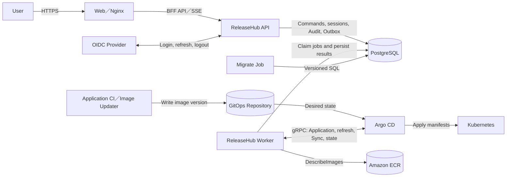

# Architecture

## Purpose and Scope

This document explains ReleaseHub runtime boundaries, data sources, and deployment control flow to platform developers and operators. ReleaseHub governs releases; it does not replace the GitOps repository, Image Updater, Argo CD, or Kubernetes controllers.

## Component Responsibilities

ReleaseHub provides four independent workloads from two container images:

| Workload | Image | Responsibility |
| --- | --- | --- |
| Web | `releasehub-web` | Static frontend, BFF API reverse proxy, and quiet health checks |
| API | `releasehub-server` | Gin HTTP API, OIDC sessions, RBAC, and management operations |
| Worker | `releasehub-server` | Candidate reconciliation, deployment queue processing, Argo CD execution, and notification projection |
| Migrate | `releasehub-server` | Versioned SQL migrations before application deployment |

API, Worker, and Migrate each use their configured PostgreSQL connection pool. OIDC sessions, Deployment Requests, the queue, Audit, and Outbox records are stored in PostgreSQL. The configuration schema currently reserves `redis.*` fields, but the runtime does not use Redis for sessions or queue storage.

Migrate is a separate one-shot Job; API and Worker never run migrations during startup. Worker uses the Argo CD gRPC API to read and operate Applications, and uses read-only AWS ECR APIs to verify image digests.

## System Boundaries and Data Flow

The GitOps repository and Image Updater keep their existing responsibilities. Image Updater or Application CI writes new image versions to the GitOps repository, and Git remains the desired state consumed by Argo CD. ReleaseHub does not write Git, control Image Updater, or set image overrides.

## Production Release Control Flow

1. Worker detects a production Candidate from Argo CD target manifests and live state.
2. Worker verifies images through ECR and creates an immutable Deployment Request Version.
3. The Release Workflow controls approvals and available transitions. The Deployment Plan controls Application dependencies and concurrency.
4. Before deployment, Worker performs a hard refresh and reloads manifests, diffs, and digests. Content drift fails closed.
5. After validation, Worker calls Argo CD Sync for the approved revision and reconciles operation, Sync, and Health state.

## Failure Boundaries and Limits

- Sync is not started when Argo CD, ECR, or target manifests cannot provide enough evidence.
- Configuration drift blocks Deployment Request creation, deployment, and Forward Rollback.
- Application operation locks and job leases are stored in PostgreSQL to prevent concurrent overwrite of one Application.
- Phase one allows exactly one Worker replica so the configured Application concurrency remains platform-wide.
- ReleaseHub does not use Argo CD history rollback. Restoring an earlier artifact uses Forward Rollback: the source process publishes a new version that follows the normal Deployment Request, approval, and deployment flow.
