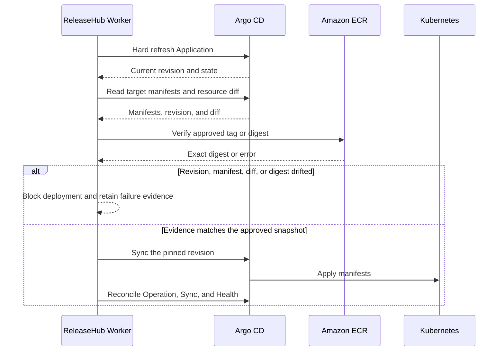

# Argo CD Integration

## Purpose and Prerequisites

ReleaseHub uses one Argo CD instance for Application discovery, onboarding, preflight validation, Sync, and result reconciliation. Worker must use a dedicated Argo CD account and gRPC token. Grant that account only the permissions required to read Applications, manifests, and resource diffs; remove automated sync; start Sync; and terminate operations.

An Application must carry this exact label:

```yaml
metadata:
  labels:
    releasehub.io/managed: "true"
```

## Application Onboarding

Worker reads the Application list, Sync, Health, Operation state, source and destination mappings, and target manifests. An administrator must still validate and confirm the candidate mapping.

After production onboarding confirmation, ReleaseHub only removes `spec.syncPolicy.automated` and verifies the result with a readback. It does not create or delete Applications or modify Argo CD Projects. Onboarding does not trigger production Sync.

## Deployment Sequence



Worker starts this sequence only after an immutable Deployment Request Version passes its Release Workflow. The Deployment Plan controls dependencies and concurrency. ReleaseHub does not write to a GitOps repository, control Image Updater, change image tags or digests, or use Argo CD history rollback.

## Configuration Drift and Stop Conditions

If the label is removed, automated sync is enabled again, the Application disappears, or its mapping changes, Worker records configuration drift and emits a notification without repairing the change automatically. While drift exists, creating a Deployment Request, deploying, and performing Forward Rollback are blocked.

If Argo CD cannot complete refresh, cannot return target manifests, reports a different operation identity, or exposes drift from the approved content, Worker remains fail closed. Do not recover by enabling automated sync or blindly resending Sync.
