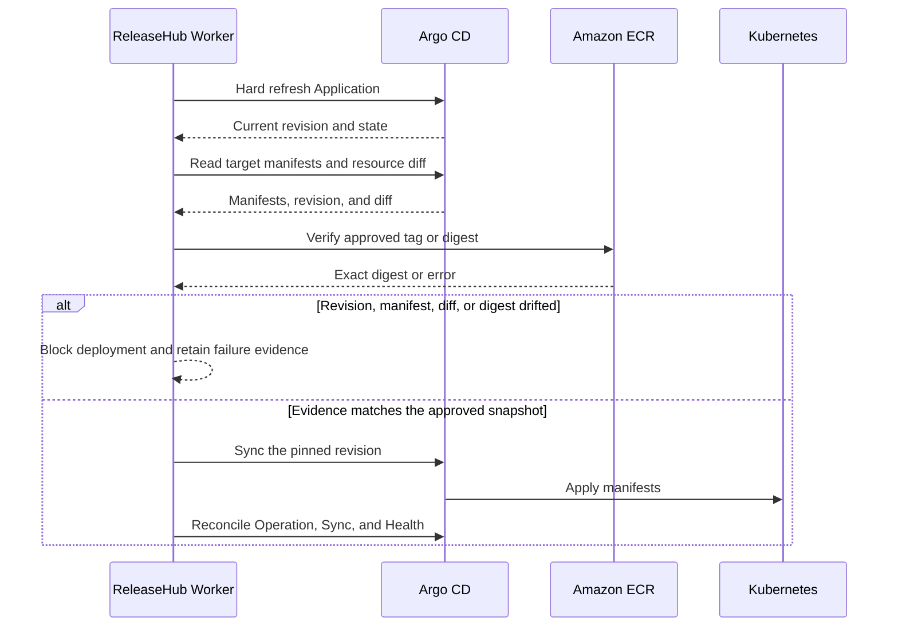

# Argo CD Integration

The [Production Release Guide](release-flow.md) follows a release from CI through Argo CD Sync. This page covers Application onboarding, gRPC transport, and Argo CD behavior during deployment.

## Purpose and Prerequisites

ReleaseHub uses one Argo CD instance for Application discovery, onboarding, preflight validation, Sync, and result reconciliation. Worker must use a dedicated Argo CD account and gRPC token. Grant that account only the permissions required to read Applications, manifests, and resource diffs; remove automated sync; start Sync; and terminate operations.

### gRPC Transport

ReleaseHub uses verified TLS for Argo CD by default. When `argocd-cmd-params-cm` sets `server.insecure: "true"`, and ReleaseHub directly reaches port 80 of `argocd-server` through the same cluster or another trusted private network, use:

```yaml
argocd:
  address: argocd-server.argocd.svc:80
  plaintext: true
  insecure: false
```

Plaintext does not require both services to run in the same EKS cluster, but DNS and network routing must reach the Service and the transport path has no TLS protection. Keep TLS with a verifiable certificate across clusters or untrusted networks. `insecure: true` only skips TLS certificate verification; it does not select plaintext. Never enable `plaintext` and `insecure` together.

An Application must carry this exact label:

```yaml
metadata:
  labels:
    releasehub.io/managed: "true"
```

## Application Onboarding

Worker reads the Application list, Sync, Health, Operation state, source and destination mappings, and target manifests. An administrator must still validate and confirm the candidate mapping.

After production onboarding confirmation, ReleaseHub only removes `spec.syncPolicy.automated` and verifies the result with a readback. It does not create or delete Applications or modify Argo CD Projects. Onboarding does not trigger production Sync.

## Deployment Sequence



Worker starts this sequence only after an immutable Deployment Request Version passes its Release Workflow. The Deployment Plan controls dependencies and concurrency. ReleaseHub does not write to a GitOps repository, control Image Updater, change image tags or digests, or use Argo CD history rollback.

## Configuration Drift and Stop Conditions

If the label is removed, automated sync is enabled again, the Application disappears, or its mapping changes, Worker records configuration drift and emits a notification without repairing the change automatically. While drift exists, creating a Deployment Request, deploying, and performing Forward Rollback are blocked.

If Argo CD cannot complete refresh, cannot return target manifests, reports a different operation identity, or exposes drift from the approved content, Worker remains fail closed. Do not recover by enabling automated sync or blindly resending Sync.

## Live Resource Topology and Node Diagnostics

Users with Application `resource.view` permission can expand live topology under Deployment execution or use the Resource topology tab on Application detail. The browser calls only ReleaseHub APIs. Argo CD endpoints, tokens, and gRPC capabilities are never delegated to users.

Resource hierarchy uses only Argo CD `ParentRefs`; network topology uses only `NetworkingInfo`. ReleaseHub shows a warning when relationship evidence is missing instead of inferring links from names, labels, or Kubernetes conventions. Active deployments refresh every five seconds. A terminal Request shows current live state rather than an immutable snapshot of that execution; the Request revision, digest, and result evidence remain the governance record.

Selecting a node opens Summary, Events, Pod Logs, and Live Manifest. Logs are available only for Pods and are bounded to 500 lines, 15 seconds, and 1 MiB per request. Events are limited to 100 entries; topology is limited to 500 nodes and 1,000 edges. Secret manifests omit `data` and `stringData`. Manifest, Events, and Logs reads add metadata-only Audit Trail records containing the actor, Application, resource identity, and action. Returned content is not persisted in audit records.

When the panel reports that runtime data is unavailable, first confirm that the user can still view the Application, then inspect the ReleaseHub-to-Argo CD gRPC connection and dedicated account permissions. A topology failure does not change Deployment execution state and should not be bypassed by exposing the Argo CD UI to general users.
