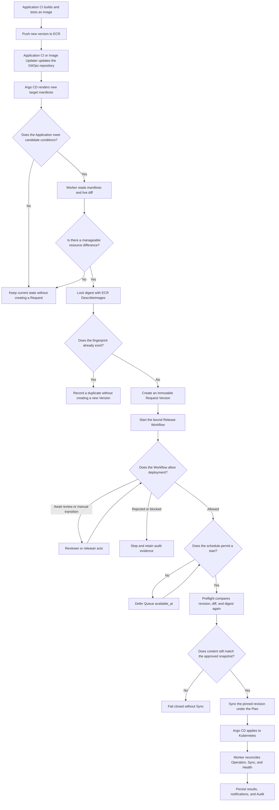
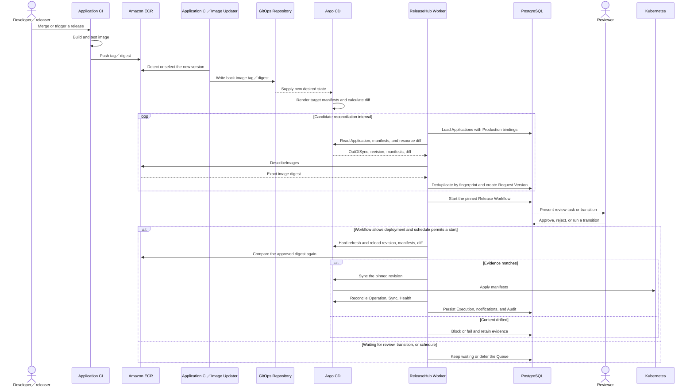
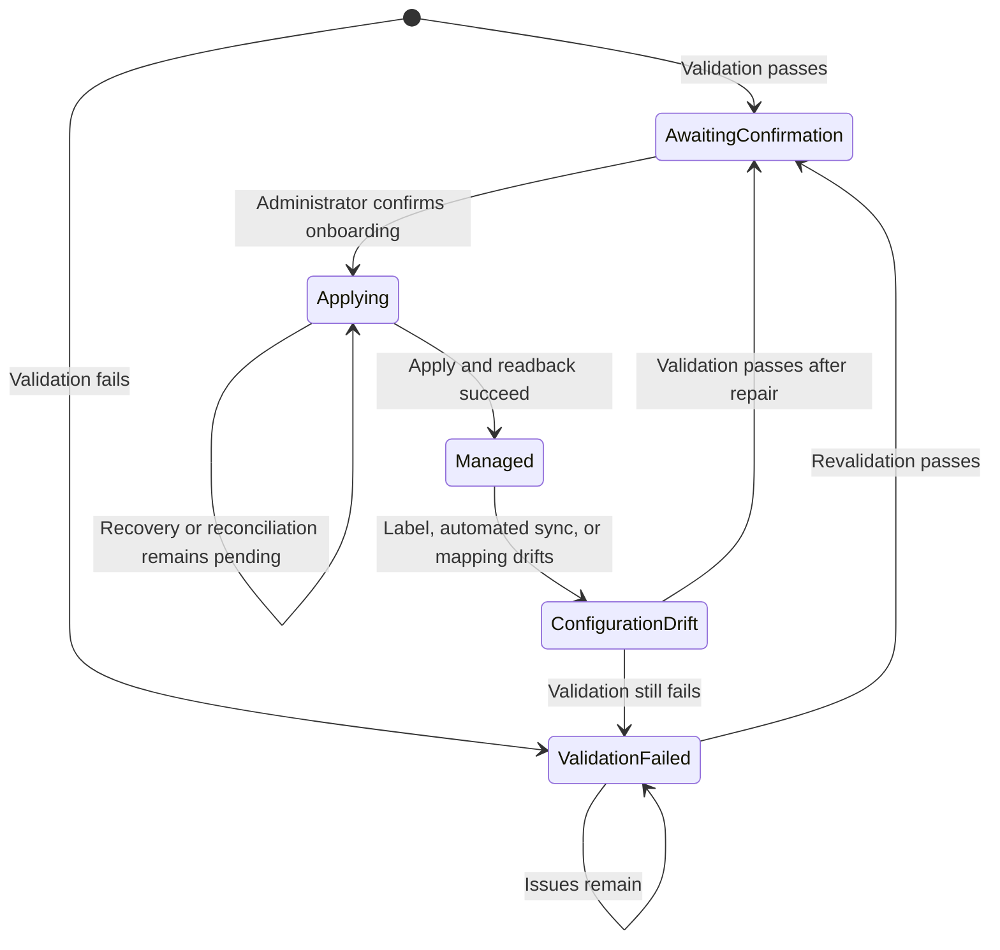
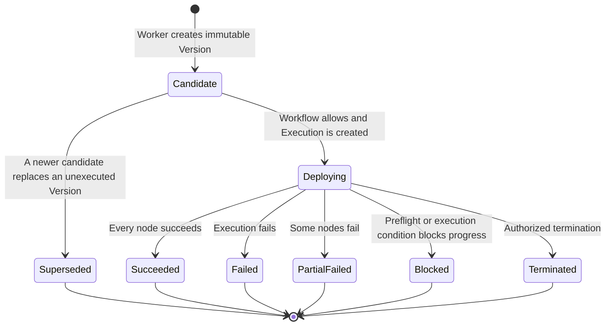
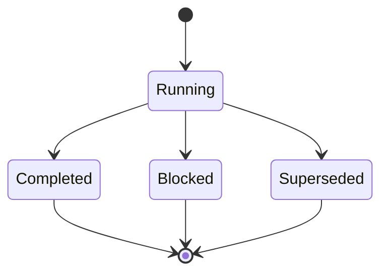

# Production Release Guide

Pushing an image to ECR does not immediately add a row to Deployment Requests. The GitOps repository must first contain new desired state. Argo CD then reports `OutOfSync` with a resource difference, giving ReleaseHub Worker a candidate to process.

Platform operators can follow this page from the first Application setup through Request review, pinned-revision Sync, and result verification. Use the [Operations Runbook](operations-runbook.md) for recovery work.

## Who Owns Each Part

| Component | Work |
| --- | --- |
| Application CI | Build, test, and push the image to ECR |
| Application CI／Argo CD Image Updater | Select a version and write its tag or digest to the GitOps repository |
| GitOps repository | Store the desired state consumed by Argo CD |
| Argo CD | Render target manifests, compare live resources, and Sync the pinned revision when ReleaseHub requests it |
| ReleaseHub Worker | Find candidates, lock ECR digests, create Requests, run preflight, request Sync, and reconcile results |
| Reviewer／releaser | Complete Workflow reviews or manual transitions |
| Kubernetes | Run the manifests applied by Argo CD |

ReleaseHub does not receive ECR push webhooks, write Git, or control Image Updater, so a new image in ECR means only the first part of the release path is complete.

## Before the First Release

Repeat these checks when an Application, Workflow, or Plan changes:

1. The Argo CD Application carries `releasehub.io/managed: "true"`.
2. ReleaseHub onboarding is `Managed`.
3. Automated sync is disabled for the production Application.
4. The Application belongs to an active `Production` Environment.
5. The Release Workflow and Deployment Plan each have a `Published` version.
6. The Environment is bound to the intended Workflow and Plan versions.
7. Each Plan node `applicationKey` exactly matches the ReleaseHub Application name. The `node key` identifies a DAG node and cannot replace `applicationKey`.
8. The image repository is in the `aws.ecr_repositories` allow-list, and Worker has `ecr:DescribeImages`.
9. Operators have the required permission at the target Organization, Project, and Environment scope.

Application and credential setup are covered by [Argo CD Integration](argocd.md) and [Amazon ECR Integration](ecr.md). For login and roles, see [OIDC and Authorization](oidc.md).

## One Release from Build to Result

A candidate Application must satisfy every gate. Its Environment is active and typed `Production`, onboarding is `Managed`, automated sync is disabled, the management label remains present, Workflow and Plan bindings are active, and Argo CD reports `OutOfSync`.

## System Sequence

## Reading Status in the UI

### Application Onboarding

Only `Managed` enters candidate reconciliation. When the page shows `ConfigurationDrift`, repair the Argo CD configuration, then revalidate and confirm it in ReleaseHub.

### Deployment Request Version

During review, the Request Version normally remains `Candidate`. The Workflow current state and review task show where approval is waiting, and the Request Version moves to `Deploying` only after an Execution is created.

### Release Workflow Instance

The instance enters `Running` when the pinned Workflow version starts. Reviews and manual or automatic transitions can advance the Workflow graph while the instance remains `Running`. A terminal state produces `Completed`. A deployment result that cannot legally advance the graph produces `Blocked`, while a newer candidate replacing the Request Version produces `Superseded`.

Workflow designers choose the state names. Review tasks have separate `Pending`, `Approved`, `Rejected`, `ReassignmentRequired`, and `Closed` values. Read Request, Workflow, Review, and Execution together when deciding whether the release is finished.

## Check Each Release Against This Table

| Step | Action | Continue when | Stop when |
| --- | --- | --- | --- |
| 1. Build | CI finishes tests and pushes an identifiable tag or digest | ECR `DescribeImages` finds the image | Build, push, or AWS permission fails |
| 2. Git write-back | CI or Image Updater updates the GitOps repository | A Git commit contains the new image version | ECR has the image but Git has not changed |
| 3. Argo CD | Wait for Argo CD to read the revision | Target revision is correct and Sync is `OutOfSync` | Revision is stale, automated sync is enabled, or the label is missing |
| 4. Candidate | Wait for the next Worker reconciliation | A new Version appears in Deployment Requests | No Request appears after the reconciliation interval |
| 5. Evidence | Check Application, revision, digest, Workflow, Plan, classification, and schedule | Every field matches the intended release | Any evidence differs from the release input |
| 6. Workflow | Use the capability shown by the UI for review or transition | Workflow enters a deployable state | Permission, review policy, or transition does not match |
| 7. Schedule | Wait for `scheduledFor`, maintenance window, and blackout checks | The reason is `Ready` and preflight passes | Revision, diff, or digest drifts during preflight |
| 8. Result | Read the reconciled result for every Application | All Plan nodes are terminal and Request／Execution results are stored | A Running Pod or one Argo CD `Succeeded` value is the only evidence |

A Workflow does not have to contain a review state. The Published Workflow version pinned by the Request decides whether a person must approve it.

## When a Request Does Not Appear

Work from the top of this table. Repair the first failed check. Do not create a substitute Request or Sync directly in Argo CD.

| Check | Healthy state | Where to look |
| --- | --- | --- |
| ECR image | `DescribeImages` finds the new version | Build, push, or AWS permission |
| GitOps repository | New tag or digest is committed | CI／Image Updater write-back |
| Argo CD target | Revision changed and status is `OutOfSync` | Argo CD has not read the change, or live state already matches |
| Onboarding | `Managed` | Onboarding is incomplete or `ConfigurationDrift` exists |
| Sync policy | Automated sync is disabled | Argo CD may already have applied the change |
| Management label | `releasehub.io/managed: "true"` remains present | Application is outside candidate scope |
| Environment | Active and typed `Production` | Other types do not create automatic Requests |
| Environment binding | Points to Published Workflow and Published Plan | No executable governance definition is active |
| Plan mapping | `applicationKey` exactly matches the Application name | Plan cannot find its node |
| Resource diff | Target differs from manageable live resources | No deployable content exists |
| ECR scope | Registry, account, region, and repository match the allow-list | Digest resolution fails closed |
| Fingerprint | This content combination is new | A duplicate candidate does not create a Version |
| Worker | Reconciliation reaches Argo CD, ECR, and PostgreSQL | Follow the Runbook for Worker or external service failure |

## Deciding That the Release Is Finished

- Request Applications, revision, and image digests match the intended release.
- Workflow and Plan versions match the Environment binding.
- Review and transitions came from accounts with the right scoped capability.
- Schedule reason and next eligible time match the Environment policy.
- Preflight found no revision, manifest, resource diff, or digest drift.
- Every Plan node is terminal, with results, notifications, and Audit available for investigation.

Repository tests verify the release rules. They cannot replace an integration exercise against real Argo CD, ECR, and Kubernetes resources. Run the full path with a non-production Application before production adoption. That external E2E exercise is still pending.

Related material: [Architecture](architecture.md), [Argo CD Integration](argocd.md), [Amazon ECR Integration](ecr.md), [Configuration](configuration.md), [Deployment](deployment.md), and [Operations Runbook](operations-runbook.md).
