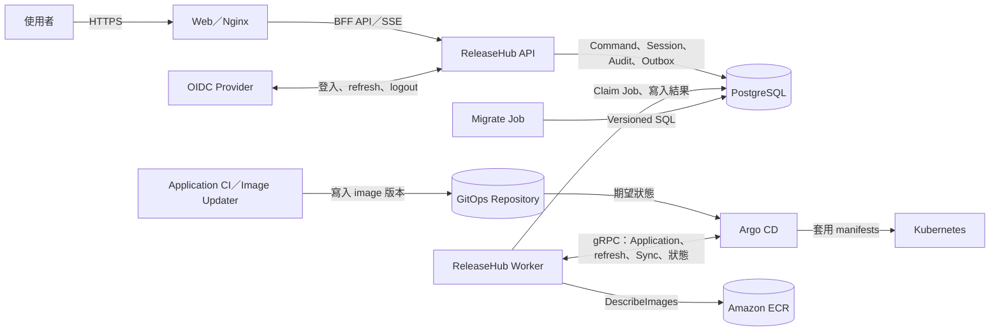

# 架構

## 目的與範圍

本文件供平台開發者與維運人員理解 ReleaseHub 的 runtime 邊界、資料來源與部署控制流。ReleaseHub 負責發佈治理，不取代 GitOps repository、Image Updater、Argo CD 或 Kubernetes controller。

## 元件責任

ReleaseHub 以兩個 container image 提供四個獨立 workload：

| Workload | Image | 責任 |
| --- | --- | --- |
| Web | `releasehub-web` | 靜態前端、BFF API reverse proxy、無日誌健康檢查 |
| API | `releasehub-server` | Gin HTTP API、OIDC session、RBAC 與管理操作 |
| Worker | `releasehub-server` | Candidate reconciliation、Deployment Queue、Argo CD 執行與通知投影 |
| Migrate | `releasehub-server` | 部署前執行 versioned SQL migration |

API、Worker 與 Migrate 各自使用對應的 PostgreSQL connection pool。OIDC session、Deployment Request、Queue、Audit 與 Outbox 均保存於 PostgreSQL。設定 schema 目前保留 `redis.*` 欄位，但 runtime 尚未使用 Redis 作為 session 或 Queue 儲存區。

Migrate 是獨立一次性 Job；API 與 Worker 啟動時不會執行 migration。Worker 透過 Argo CD gRPC API 讀取及操作 Application，並以 AWS ECR read-only API 驗證 image digest。

## 系統邊界與資料流

GitOps repository 與 Image Updater 的責任不變：Image Updater 或 Application CI 負責把新 image 版本寫入 GitOps repository，Argo CD 以 Git 為期望狀態。ReleaseHub 不寫 Git、不控制 Image Updater、不設定 image override。

## Production 發佈控制流

1. Worker 從 Argo CD target manifests 與 live state 偵測 production Candidate。
2. Worker 以 ECR 驗證 image，並建立不可變的 Deployment Request Version。
3. Release Workflow 決定審核與可用轉換；Deployment Plan 決定 Application 相依關係與並行方式。
4. 部署前，Worker 執行 hard refresh，重新取得 manifests、diff 與 digest；內容漂移時失敗封閉。
5. 驗證通過後，Worker 對核准的 revision 呼叫 Argo CD Sync，並持續對帳 operation、Sync 與 Health。

## 失敗邊界與限制

- Argo CD、ECR 或 target manifests 無法提供足夠證據時，不執行 Sync。
- 設定漂移會阻擋建立 Deployment Request、部署及 Forward Rollback。
- Application operation lock 與 Job lease 保存於 PostgreSQL，避免同一 Application 被並行覆寫。
- 第一階段只允許一個 Worker replica，確保設定的 Application 並行數是全平台上限。
- ReleaseHub 不使用 Argo CD history rollback。回復歷史版本採 Forward Rollback，由來源流程產生新版本，再走一般 Deployment Request、審核與部署流程。
