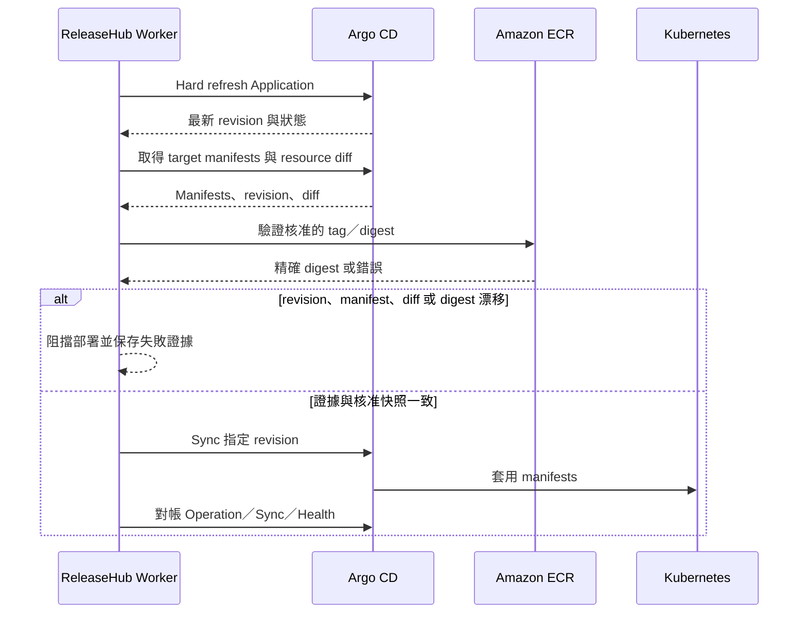

# Argo CD 整合

## 目的與前置條件

ReleaseHub 透過單一 Argo CD instance 執行 Application discovery、onboarding、部署前驗證、Sync 與結果對帳。Worker 必須使用專用 Argo CD account 與 gRPC token；該 account 只授予讀取 Application／manifests／resource diff、移除 automated sync、執行 Sync 及終止 operation 所需權限。

Application 必須精確設定：

```yaml
metadata:
  labels:
    releasehub.io/managed: "true"
```

## Application Onboarding

Worker 讀取 Application 清單、Sync／Health／Operation 狀態、source／destination mapping 與 target manifests。候選 Application 仍需由管理者完成 mapping 驗證及人工確認。

Production onboarding 確認後，ReleaseHub 只會移除 `spec.syncPolicy.automated`，再讀回驗證。ReleaseHub 不建立或刪除 Application，也不修改 Argo CD Project。Onboarding 本身不觸發 production Sync。

## 部署時序



當不可變的 Deployment Request Version 通過 Release Workflow，Worker 才會執行上述時序，並依 Deployment Plan 控制相依關係與平行數。ReleaseHub 不寫 GitOps repository、不控制 Image Updater、不改 image tag／digest，也不使用 Argo CD history rollback。

## 設定漂移與停止條件

若 label 被移除、automated sync 被重開、Application 消失或 mapping 改變，Worker 只標記 configuration drift 並通知，不會自行修正。設定漂移存在時禁止建立 Deployment Request、部署及 Forward Rollback。

Argo CD 無法完成 refresh、無法回傳 target manifests、operation identity 不一致，或核准內容已漂移時，Worker 必須維持失敗封閉，不得以重開 automated sync 或盲目重送 Sync 恢復。
