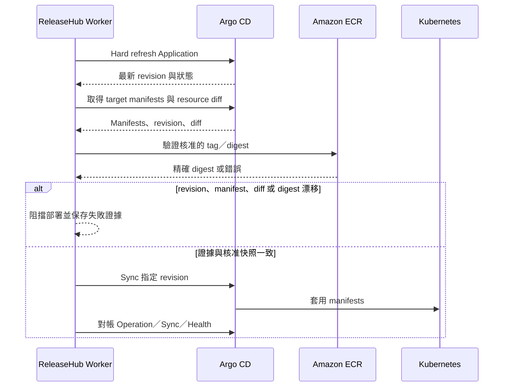

# Argo CD 整合

CI 到 Argo CD Sync 的操作順序在 [Production 發布操作指南](release-flow.md)。本頁集中說明 Application onboarding、gRPC 連線及部署時的 Argo CD 行為。

## 目的與前置條件

ReleaseHub 透過單一 Argo CD instance 執行 Application discovery、onboarding、部署前驗證、Sync 與結果對帳。Worker 必須使用專用 Argo CD account 與 gRPC token；該 account 只授予讀取 Application／manifests／resource diff、移除 automated sync、執行 Sync 及終止 operation 所需權限。

### gRPC transport

ReleaseHub 預設以 TLS 連線並驗證 Argo CD 憑證。若 `argocd-cmd-params-cm` 設定 `server.insecure: "true"`，且 ReleaseHub 經由同一叢集或可受信任私有網路直接連線 `argocd-server` 的 port 80，可使用：

```yaml
argocd:
  address: argocd-server.argocd.svc:80
  plaintext: true
  insecure: false
```

`plaintext` 不要求兩個服務位於同一個 EKS cluster，但 DNS 與網路路由必須可達，且傳輸路徑沒有 TLS 保護。跨 cluster 或跨不受信任網路時，應保留 TLS，並配置可驗證的憑證；`insecure: true` 只會略過 TLS 憑證驗證，不會切換為 plaintext。禁止同時設定 `plaintext: true` 與 `insecure: true`。

Application 必須精確設定：

```yaml
metadata:
  labels:
    releasehub.io/managed: "true"
```

## Application Onboarding

Worker 讀取 Application 清單、Sync／Health／Operation 狀態、source／destination mapping 與 target manifests。候選 Application 仍需由管理者完成 mapping 驗證及人工確認。

Production onboarding 確認後，ReleaseHub 只會移除 `spec.syncPolicy.automated`，再讀回驗證。ReleaseHub 不建立或刪除 Application，也不修改 Argo CD Project。Onboarding 本身不觸發 production Sync。

## 部署時序



當不可變的 Deployment Request Version 通過 Release Workflow，Worker 才會執行上述時序，並依 Deployment Plan 控制相依關係與平行數。ReleaseHub 不寫 GitOps repository、不控制 Image Updater、不改 image tag／digest，也不使用 Argo CD history rollback。

## 設定漂移與停止條件

若 label 被移除、automated sync 被重開、Application 消失或 mapping 改變，Worker 只標記 configuration drift 並通知，不會自行修正。設定漂移存在時禁止建立 Deployment Request、部署及 Forward Rollback。

Argo CD 無法完成 refresh、無法回傳 target manifests、operation identity 不一致，或核准內容已漂移時，Worker 必須維持失敗封閉，不得以重開 automated sync 或盲目重送 Sync 恢復。

## 即時資源拓撲與節點診斷

具備 Application `resource.view` 權限的使用者可在 Deployment Request 的「Deployment 執行狀態」展開即時拓撲，也可從 Application 詳細頁的「資源拓撲」頁籤查看。瀏覽器只呼叫 ReleaseHub API；Argo CD endpoint、token 與 gRPC capability 不會交給使用者。

「資源階層」只呈現 Argo CD `ParentRefs`，「網路拓撲」只呈現 `NetworkingInfo`。缺少關係證據時，ReleaseHub 會顯示警告，不會從名稱、label 或 Kubernetes 慣例推測連線。部署進行中每 5 秒更新；終態 Request 顯示的是目前即時狀態，不是該次 execution 的不可變快照，Request 原有 revision、digest 與結果證據仍是治理依據。

選取節點後可查看摘要、Events、Pod Logs 與 Live Manifest。Logs 只開放 Pod，單次最多 500 行並受 15 秒與 1 MiB 限制；Events 最多 100 筆；拓撲最多 500 個節點與 1,000 條關係。Secret Manifest 會移除 `data` 與 `stringData`。Manifest、Events 與 Logs 的讀取會留下只含 actor、Application、resource identity 與 action 的 Audit Trail，不保存回傳內容。

若面板顯示 unavailable，先確認使用者仍可查看該 Application，再檢查 ReleaseHub 到 Argo CD 的 gRPC 連線與專用 account 權限。拓撲失敗不會改變 Deployment execution 狀態，也不應以直接開放 Argo CD UI 作為一般使用者的替代處理。
