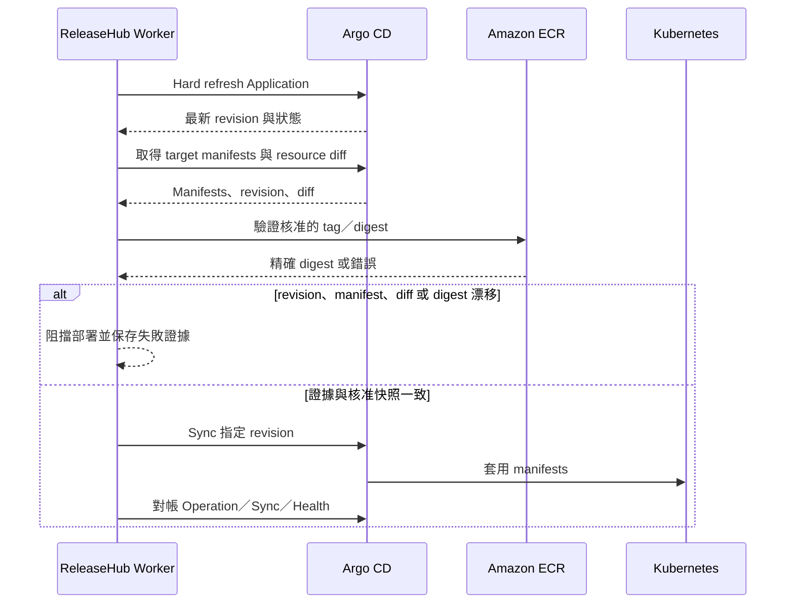

# Argo CD 整合

CI 到 Argo CD Sync 的操作順序在 [Production 發布操作指南](release-flow.md)。本頁集中說明 Application onboarding、gRPC 連線及部署時的 Argo CD 行為。

## 目的與前置條件

ReleaseHub 透過單一 Argo CD instance 執行 Application discovery、onboarding、部署前驗證、Sync 與結果對帳。Worker 必須使用專用 Argo CD account 與 gRPC token；該 account 只授予讀取 Application／manifests／resource diff、移除 automated sync、執行 Sync 及終止 operation 所需權限。

### gRPC transport

ReleaseHub 預設以 TLS 連線並驗證 Argo CD 憑證。若 `argocd-cmd-params-cm` 設定 `server.insecure: "true"`，且 ReleaseHub 經由同一叢集或可受信任私有網路直接連線 `argocd-server` 的 port 80，可使用：

```yaml
argocd:
  address: argocd-server.argocd.svc:80
  plaintext: true
  insecure: false
```

`plaintext` 不要求兩個服務位於同一個 EKS cluster，但 DNS 與網路路由必須可達，且傳輸路徑沒有 TLS 保護。跨 cluster 或跨不受信任網路時，應保留 TLS，並配置可驗證的憑證；`insecure: true` 只會略過 TLS 憑證驗證，不會切換為 plaintext。禁止同時設定 `plaintext: true` 與 `insecure: true`。

Application 必須精確設定：

```yaml
metadata:
  labels:
    releasehub.io/managed: "true"
```

## Application Onboarding

Worker 讀取 Application 清單、Sync／Health／Operation 狀態、source／destination mapping 與 target manifests。候選 Application 仍需由管理者完成 mapping 驗證及人工確認。

Production onboarding 確認後，ReleaseHub 只會移除 `spec.syncPolicy.automated`，再讀回驗證。ReleaseHub 不建立或刪除 Application，也不修改 Argo CD Project。Onboarding 本身不觸發 production Sync。

## 部署時序


```mermaid
sequenceDiagram
  participant Worker as ReleaseHub Worker
  participant Argo as Argo CD
  participant ECR as Amazon ECR
  participant K8s as Kubernetes

  Worker->>Argo: Hard refresh Application
  Argo-->>Worker: 最新 revision 與狀態
  Worker->>Argo: 取得 target manifests 與 resource diff
  Argo-->>Worker: Manifests、revision、diff
  Worker->>ECR: 驗證核准的 tag／digest
  ECR-->>Worker: 精確 digest 或錯誤
  alt revision、manifest、diff 或 digest 漂移
    Worker-->>Worker: 阻擋部署並保存失敗證據
  else 證據與核准快照一致
    Worker->>Argo: Sync 指定 revision
    Argo->>K8s: 套用 manifests
    Worker->>Argo: 對帳 Operation／Sync／Health
  end
```

當不可變的 Deployment Request Version 通過 Release Workflow，Worker 才會執行上述時序，並依 Deployment Plan 控制相依關係與平行數。ReleaseHub 不寫 GitOps repository、不控制 Image Updater、不改 image tag／digest，也不使用 Argo CD history rollback。

## 設定漂移與停止條件

若 label 被移除、automated sync 被重開、Application 消失或 mapping 改變，Worker 只標記 configuration drift 並通知，不會自行修正。設定漂移存在時禁止建立 Deployment Request、部署及 Forward Rollback。

Argo CD 無法完成 refresh、無法回傳 target manifests、operation identity 不一致，或核准內容已漂移時，Worker 必須維持失敗封閉，不得以重開 automated sync 或盲目重送 Sync 恢復。

## 即時資源拓撲與節點診斷

具備 Application `resource.view` 權限的使用者可在 Deployment Request 的「Deployment 執行狀態」展開即時拓撲，也可從 Application 詳細頁的「資源拓撲」頁籤查看。瀏覽器只呼叫 ReleaseHub API；Argo CD endpoint、token 與 gRPC capability 不會交給使用者。

「資源階層」的實際資源關係只來自 Argo CD `ParentRefs`；Application 根節點與虛線僅代表畫面聚合，不是 Kubernetes owner 關係。「網路拓撲」只使用 `NetworkingInfo`。ReleaseHub 會解析明確的 target reference，以及 Argo CD 回傳的 selector／resource labels；reference 省略 group 或 version 時，只有唯一符合其餘 identity 欄位的資源才會建立連線。完全沒有關係證據時顯示 unavailable；已有證據但部分 reference 或 selector 無法安全解析時，保留可證明的子圖並顯示 unresolved 警告，不會從名稱或 Kubernetes 慣例猜測連線。部署進行中，展開且可見的拓撲每 5 秒更新；終態 Request 顯示的是目前即時狀態，不是該次 execution 的不可變快照，Request 原有 revision、digest 與結果證據仍是治理依據。

選取實際資源節點後，可在同頁大型置中唯讀視窗查看摘要、Events、Pod Logs 與 Live Manifest；不提供 Sync、刪除或編輯資源。切換至對應分頁才查詢 Events、Logs 或 Manifest。按 Escape 或關閉按鈕返回拓撲，保留視角並恢復可用的焦點位置。Logs 只開放 Pod，請求最新 500 行，回應最多 500 筆記錄（每筆可含多行），訊息內容累計最多 1 MiB，且受最長 15 秒與較短的請求期限限制；Events 最多 100 筆；拓撲最多 500 個節點與 1,000 條關係。Secret Manifest 會移除 `data` 與 `stringData`。Manifest、Events 與 Logs 的讀取會留下只含 actor、Application、resource identity 與 action 的 Audit Trail，不保存回傳內容。

### 閱讀即時 Manifest

有效 JSON 預設以兩格縮排顯示，保留欄位順序與數字原值。`metadata.managedFields` 預設隱藏並顯示提示；需要檢查時，勾選顯示選項或切換「完整原文」。這是閱讀控制，不會修改 Kubernetes 資源或 API 快取。「完整原文」仍是 Server 已遮罩的回應，無法還原 Secret 內容。

長行預設以內容區水平捲動閱讀，也可勾選「自動換行」。非 JSON、格式錯誤或超過前端格式化處理上限時，介面會提示並保留完整的 API 回應原文，而不是讓整個視窗失效。空內容另顯示空狀態；API 讀取失敗則顯示錯誤，不會當成空內容。

### 閱讀 Pod 日誌

API 時間與訊息各占一欄；「顯示 API 時間」只控制左側時間欄，不刪除訊息內的應用程式時間或 JSON 欄位。每筆記錄維持回傳順序與多行堆疊，不因相同時間合併，也不重新排序。長行預設水平捲動，可選擇「自動換行」。閱讀控制可用鍵盤操作，內容區可取得焦點並捲動。

「可讀模式」移除完整 ANSI 控制序列；未完整序列、退格、覆寫行與其他控制字元以可見跳脫呈現，不執行終端指令、HTML 或連結。「原文（跳脫）」以含引號的 JSON 字串顯示每個欄位，保留換行、反斜線及控制字元的差異；看到 `\n` 或 `\u001b` 是原文字元的表示法，不是新增的日誌內容。

日誌是有限快照，不是持續追蹤串流。達到記錄或內容預算即停止收集；無法容納的整筆訊息不會切碎加入，因此畫面不代表完整歷史。串流讀取失敗會顯示錯誤，不將已收到的部分記錄當成成功結果；沒有記錄才顯示空日誌提示。Manifest／Logs 分頁錯誤不影響摘要或原本的部署結果。

### 判讀不完整資料與重新整理

節點或關係超過上限時，拓撲會同時保留可顯示子圖與警告；即使畫面上仍有 Healthy 節點，也不能把這張圖當成完整清單。可用「重新整理」重新查詢；警告是否消失取決於新的回應，重新整理本身不會部署、重試 execution 或改變核准結果。網路關係證據不足也不等於部署失敗。

若面板顯示 unavailable，先確認使用者仍可查看該 Application，再檢查 ReleaseHub 到 Argo CD 的 gRPC 連線與專用 account 權限。拓撲失敗不會改變 Deployment execution 狀態，也不應以直接開放 Argo CD UI 作為一般使用者的替代處理。

若 Web 更新後開啟尚未載入的頁面時顯示「ReleaseHub 已更新」，代表舊頁面要求的程式檔案已失效。系統會針對同一版本自動重新載入最多一次；若仍無法載入，側邊欄與「重新載入」按鈕會保留。先確認 Web 服務是否可正常提供新版 `index.html` 與 hashed assets，再使用按鈕重試；不需要將清除瀏覽器快取當作唯一處置。這種頁面資源錯誤不代表 Deployment execution 失敗。
