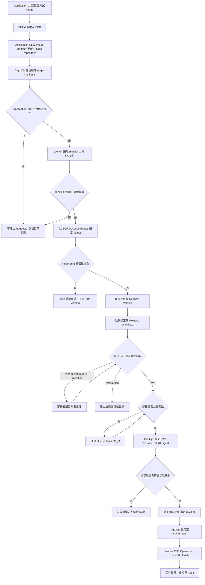
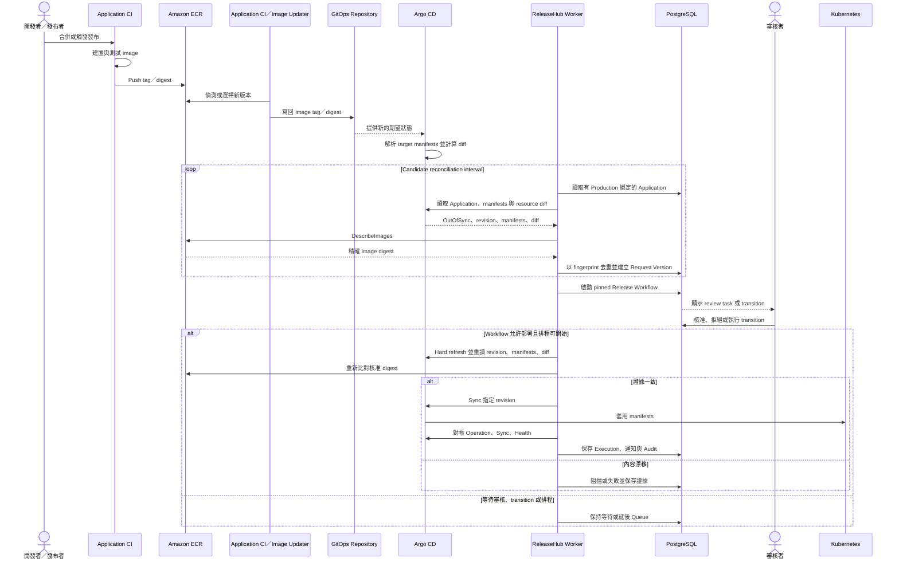
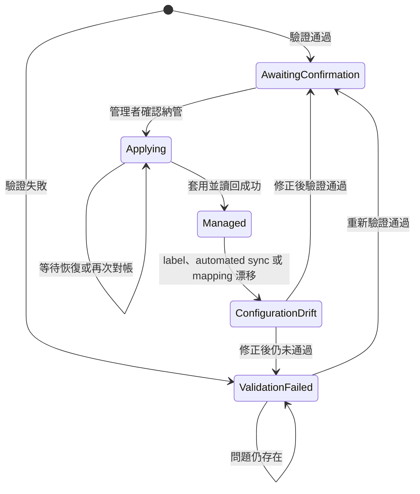
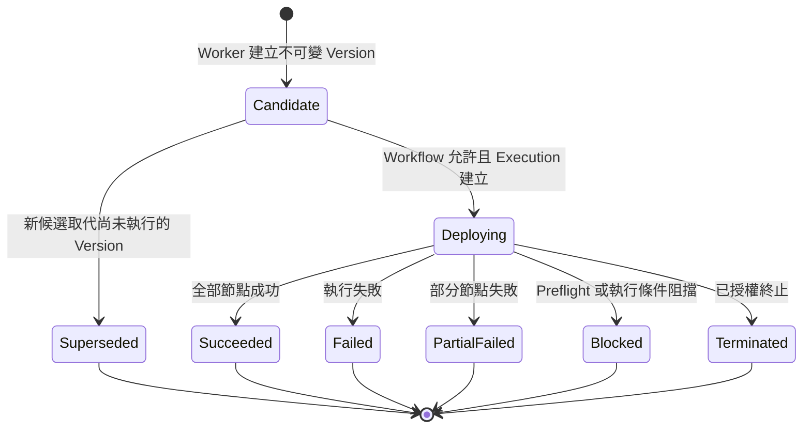
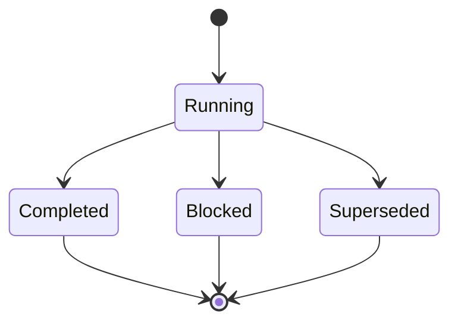

# Production 發布操作指南

Image push 到 ECR 後，Deployment Requests 頁面不會立刻多一筆資料。GitOps repository 必須先出現新的期望狀態，Argo CD 接著算出 `OutOfSync` 和 resource diff，ReleaseHub Worker 才有候選版本可處理。

平台操作者可以沿著本頁，從第一次接 Application 一路做到 Request 審核、指定 revision Sync 和結果確認。異常復原另見[操作 Runbook](operations-runbook.md)。

## 系統各自負責什麼

| 元件 | 工作 |
| --- | --- |
| Application CI | 建置、測試並推送 image 至 ECR |
| Application CI／Argo CD Image Updater | 選定新版本，把 image tag 或 digest 寫回 GitOps repository |
| GitOps repository | 保存 Argo CD 要讀取的期望狀態 |
| Argo CD | 解析 target manifests、比對 live resources，收到 ReleaseHub 指示後 Sync 指定 revision |
| ReleaseHub Worker | 找候選版本、鎖定 ECR digest、建立 Request、執行 preflight、要求 Sync 並對帳結果 |
| 審核者／發布者 | 依 Workflow 完成審核或 manual transition |
| Kubernetes | 執行 Argo CD 套用的 manifests |

ReleaseHub 不接收 ECR push webhook，也不寫 Git 或控制 Image Updater，所以 ECR 裡有新 image 只代表第一段工作做完了。

## 第一次發布前

以下設定只需在 Application、Workflow 或 Plan 改版時重做：

1. Argo CD Application 有 `releasehub.io/managed: "true"` label。
2. ReleaseHub onboarding 狀態為 `Managed`。
3. Production Application 的 automated sync 已停用。
4. Application 已放進有效的 `Production` Environment。
5. Release Workflow 和 Deployment Plan 都有 `Published` version。
6. Environment 已綁定要使用的 Workflow version 與 Plan version。
7. Plan node 的 `applicationKey` 和 ReleaseHub Application 名稱完全相同。`node key` 是 DAG 節點識別值，不能拿來代替 `applicationKey`。
8. Image repository 位於 `aws.ecr_repositories` allow-list，Worker 身分有 `ecr:DescribeImages`。
9. 操作者在目標 Organization、Project 和 Environment scope 內有對應權限。

Application 與憑證設定在 [Argo CD 整合](argocd.md)及 [Amazon ECR 整合](ecr.md)。登入與 Role 規則在 [OIDC 與授權](oidc.md)。

## 一次發布怎麼走

候選 Application 必須同時滿足幾個條件：Environment 有效且類型為 `Production`，onboarding 為 `Managed`，automated sync 關閉，管理 label 還在，Workflow／Plan 綁定有效，而且 Argo CD 回報 `OutOfSync`。

## 系統時序

## 畫面上的狀態怎麼讀

### Application onboarding

只有 `Managed` 會進入候選偵測。看到 `ConfigurationDrift` 時，先修正 Argo CD 設定，再回 ReleaseHub 重新驗證與確認。

### Deployment Request Version

審核期間，Request Version 通常仍是 `Candidate`。目前卡在哪個審核節點，要看 Workflow current state 和 review task，等 Execution 建立後 Request Version 才會進入 `Deploying`。

### Release Workflow instance

啟動 pinned Workflow version 後，instance 進入 `Running`。Review 和 manual／automatic transition 可以持續推進 Workflow graph，instance 在到達 terminal state 前仍保持 `Running`。進入 terminal state 後是 `Completed`，部署結果無法合法推進時是 `Blocked`，新候選取代 Request Version 時則是 `Superseded`。

Workflow state name 由 Workflow 設計者命名。Review task 另有 `Pending`、`Approved`、`Rejected`、`ReassignmentRequired` 和 `Closed`，所以判斷整體進度時要一起看 Request、Workflow、Review 與 Execution。

## 每次發布照這張表檢查

| 步驟 | 要做的事 | 看到什麼才繼續 | 什麼情況要停 |
| --- | --- | --- | --- |
| 1. Build | CI 完成測試並 push 可識別的 tag 或 digest | ECR `DescribeImages` 查得到 image | Build、push 或 AWS 權限失敗 |
| 2. Git write-back | CI 或 Image Updater 更新 GitOps repository | Git commit 已包含新 image 版本 | ECR 有 image，但 Git 沒變 |
| 3. Argo CD | 等 Argo CD 讀到新 revision | Target revision 正確且 Sync 為 `OutOfSync` | Revision 未更新、automated sync 被打開或 label 消失 |
| 4. Candidate | 等下一輪 Worker reconciliation | Deployment Requests 出現新 Version | 超過 reconciliation interval 仍沒有 Request，改查下一節 |
| 5. Evidence | 核對 Application、revision、digest、Workflow、Plan、分類及排程 | 每個欄位都符合本次發布 | 任何 evidence 與預期不同 |
| 6. Workflow | 依畫面提供的 capability 完成 review 或 transition | Workflow 進入可部署 state | 權限、審核條件或 transition 不符合 |
| 7. Schedule | 等 `scheduledFor`、maintenance window 和 blackout 都允許 | 畫面原因為 `Ready`，preflight 通過 | Revision、diff 或 digest 在 preflight 漂移 |
| 8. Result | 看 ReleaseHub 對帳後的每個 Application 結果 | Plan nodes 都有終態，Request／Execution 已保存結果 | 只看到 Pod Running 或一次 Argo CD `Succeeded`，證據還不夠 |

Workflow 不一定含 review state。是否需要人工審核，以 Request 固定的 Published Workflow version 為準。

## Request 沒出現時

從表格上方往下查。找到第一個不符合的項目就先處理，不要另外建立 Request，也不要直接在 Argo CD Sync。

| 檢查 | 正常狀態 | 問題方向 |
| --- | --- | --- |
| ECR image | `DescribeImages` 查得到新版本 | Build、push 或 AWS 權限 |
| GitOps repository | 已寫入新 tag 或 digest | CI／Image Updater write-back |
| Argo CD target | Revision 已更新且為 `OutOfSync` | Argo CD 尚未讀到變更，或 live state 已相同 |
| Onboarding | `Managed` | Onboarding 未完成或發生 `ConfigurationDrift` |
| Sync policy | Automated sync 關閉 | Argo CD 可能已先套用變更 |
| Management label | `releasehub.io/managed: "true"` 還在 | Application 已離開候選範圍 |
| Environment | 有效且類型為 `Production` | 其他類型不會自動建立 Request |
| Environment binding | 指向 Published Workflow 與 Published Plan | 沒有可執行的治理定義 |
| Plan mapping | `applicationKey` 精確符合 Application 名稱 | Plan 找不到對應 node |
| Resource diff | Target 與可管理 live resources 有差異 | 沒有可部署內容 |
| ECR scope | Registry、account、region、repository 都符合 allow-list | Digest 解析失敗封閉 |
| Fingerprint | 這組內容尚未建立過 | 重複候選不會產生新 Version |
| Worker | 能連線 Argo CD、ECR、PostgreSQL 並持續 reconciliation | 依 Runbook 查 Worker 與外部服務 |

## 發布完成的判斷

- Request 裡的 Application、revision 和 image digest 是本次要發布的內容。
- Workflow、Plan version 與 Environment binding 都正確。
- Review 和 transition 由具有正確 scope capability 的帳號執行。
- Schedule reason、next eligible time 與 Environment policy 一致。
- Preflight 沒有 revision、manifest、resource diff 或 digest drift。
- 每個 Plan node 都進入終態，結果、通知與 Audit 可以追查。

Repository 測試能驗證流程規則，不能取代真實 Argo CD、ECR 和 Kubernetes 的整合演練。正式採用前，應先用非 Production Application 跑完整條鏈路。這項外部 E2E 目前仍待執行。

相關資料：[架構](architecture.md)、[Argo CD 整合](argocd.md)、[Amazon ECR 整合](ecr.md)、[設定](configuration.md)、[部署](deployment.md)、[操作 Runbook](operations-runbook.md)。
